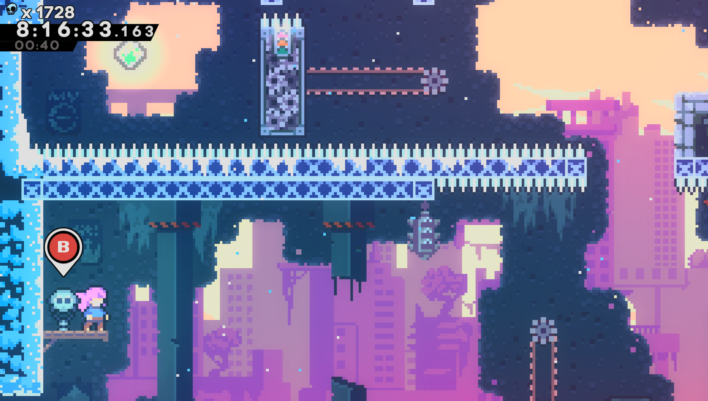

# 🕹️ **DeathCounter** _(A Celeste Mod)_

**Track and display your total deaths or chapter deaths in-game.**  
This mod is designed for compatibility with **Everest** and **AutoSplitterCore**.

🔗 **Integration with AutoSplitterCore:**  
[GitHub: AutoSplitterCore](https://github.com/neimex23/AutoSplitterCore)

---

## 💡 **Features**

✔️ Track and display the total number of deaths across your playthrough.  
✔️ Show the number of deaths in the current chapter.  
✔️ Switch between different death counters via the Everest mod settings.  
✔️ Seamless integration with AutoSplitterCore for autosplitting HCM.

---

## ⚙️ **Installation**

1. Download the latest release from the [Releases](https://github.com/neimex23/DeathCounter/releases) page.
2. Extract the contents into your **Celeste/Mods** folder.
3. Ensure you have the latest version of **Everest** installed.
4. Launch Celeste and enable the mod in the Mod Options menu.

---

## 🛠️ **Configuration**

You can customize which death counter is displayed by going to:  
**Main Menu > Mod Options > DeathCounter**

Options available:

- **Show Chapter Deaths:** Display deaths within the current chapter.

Only one of these options can be active at a time.

---

## 🤝 **Credits**

This mod is inspired by:

- **[DeathTracker](https://gamebanana.com/mods/53681)** by _Domii_ ([GitHub](https://github.com/FakeDomi/DeathTracker)) - License: MIT
- **[DeathCount](https://github.com/Thanatos0173/DeathCount)** by _Thanatos0173_ - License: MIT

Developed and maintained by **[Neimex23](https://github.com/neimex23)**.

---

## 📜 **License**

This project is licensed under the **MIT License**.  
See the [LICENSE](LICENSE) file for details.

---

## 🌎 **Links**

- 🔥 **GitHub Repository:** [DeathCounter](https://github.com/neimex23/DeathCounter)
- 🌐 **Everest Mod Loader:** [Everest](https://everestapi.github.io/)
- 🕹️ **Celeste Speedrunning Community:** [Speedrun.com](https://www.speedrun.com/celeste)

---
